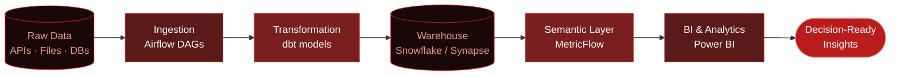

---

## 📋 Table of Contents
- [About Me](#about-me)
- [Highlights](#highlights)
- [Tech Stack](#tech-stack)
- [Skills](#skills)
- [How I Build Data Pipelines](#how-i-build-data-pipelines)
- [Selected Projects](#selected-projects)
- [How I Work](#how-i-work)
- [Get in Touch](#get-in-touch)
- [Quote](#quote)

---

## About Me

Data Engineering student ranked 1st in IT at Capital University, currently completing a Data Engineering internship at **Digital Egypt Pioneers (DEPI)**. I build ETL/ELT pipelines with Apache Airflow, model dimensional warehouses with dbt, and ship cloud data infrastructure on Azure and Snowflake. Earlier work spans AI/ML pipelines and BI dashboarding, so I design data platforms with the downstream analytics and AI use case in mind, not just the pipe.

---

## Highlights

- **Hands-on experience** building production-style ETL/ELT pipelines with Apache Airflow DAGs
- **Dimensional data warehouse design** (Star/Snowflake schema) using dbt and MetricFlow
- **Comfortable across the full data stack**: ingestion, cloud warehousing (Azure Synapse, Snowflake), and BI (Power BI, Tableau)
- **Strong SQL fundamentals**: CTEs, window functions, schema design
- **Ranked 1st in Information Technology (IT)** at Capital University

---

## Tech Stack

---

**🗄️ Data Warehousing**

**☁️ Cloud Platforms**

**🔴 SQL**

**🐍 Python for Analytics**

**🤖 AI & Advanced Analytics**

<strong>🔴 Power BI — click to expand full breakdown</strong>

 

---

## How I Build Data Pipelines

---

## Selected Projects

### [Earnest Transformations](https://github.com/Menna-Rady/earnest_transformations)
dbt project for Egyptian e-commerce analytics with a MetricFlow semantic layer on Snowflake, built on a star schema for analytical querying.
- **Tech**: dbt, Snowflake, MetricFlow, Star Schema, Analytics Engineering

### Olympic Medals Data Pipeline
End-to-end automated ETL pipeline using Airflow DAGs to scrape live Olympic medal data from Wikipedia into 6 structured datasets, with a multi-layer dbt warehouse (`fact_games_summary`, `fact_sport_summary`, `dim_olympics`, `dim_host`, `dim_sport`, `dim_season`) and Docker/Astro CLI containerization.
- **Tech**: Apache Airflow, dbt, DuckDB, Docker, Python, BeautifulSoup, SQL

### [Cairo Weather Prediction](https://github.com/Menna-Rady/AI-Cairo-Weather)
EDA and a Linear Regression model over 15+ years of Cairo weather data (2009–2025), deployed as an interactive Streamlit app with prediction, advice, and reporting views.
- **Tech**: Python, Scikit-learn, Pandas, Streamlit, Matplotlib

### Student Mental Stress Analysis
Multi-page Power BI dashboard analyzing stress patterns across 760 university students, with drill-through filters across academic performance, counseling attendance, and lifestyle factors.
- **Tech**: Power BI, DAX, Data Modeling

---

## How I Work

- **Schema first, ETL second**: I design data models before writing pipeline code
- **Automated quality validation**: I validate data quality with automated checks (dbt tests, schema constraints) rather than manual review
- **Clear data lineage**: I document pipelines so the next person (or future me) can trace data lineage
- **Reproducible environments**: I use containerization (Docker) to keep environments reproducible

---

## Get in Touch

- **Portfolio**: [menna-rady.github.io/portfolio](https://menna-rady.github.io/portfolio/)
- **LinkedIn**: [menna-mohammed0](https://linkedin.com/in/menna-mohammed0)
- **GitHub**: [@Menna-Rady](https://github.com/Menna-Rady)
- **Email**: [mennarady15@gmail.com](mailto:mennarady15@gmail.com)

Open to Data Engineering and Analytics Engineering opportunities.

---

## Quote

> Good data infrastructure is invisible when it works, and unmistakable when it doesn't.

---

### GitHub Stats

